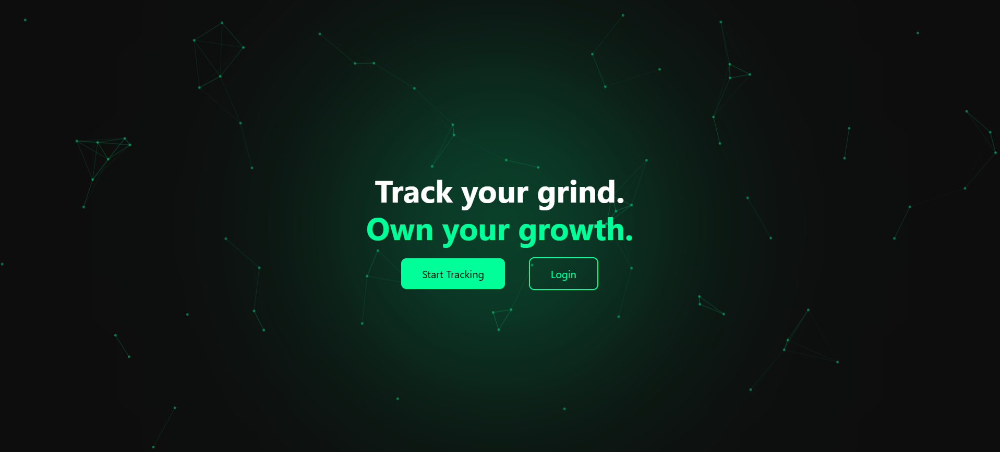
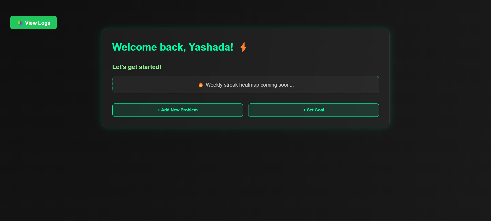
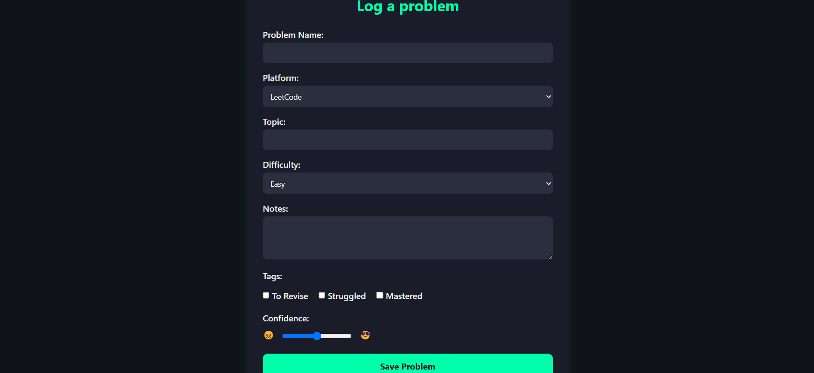

# 🔥 StreakForge

**Track your grind. Own your growth. 🚀**

StreakForge is a minimal yet powerful productivity tracker for coders. Log your daily challenges, visualize your streaks, and grow like a pro. Built using HTML, CSS, and JavaScript – it’s fast, local-first, and distraction-free.

---

### 🌟 Features

- ⚡ Beautiful landing page with terminal-glow & particle animation
- 📊 Dashboard showing weekly progress, goal tracker, and a streak heatmap
- 🧠 Problem Logger with:
  - Platform, topic, difficulty, tags & confidence level
  - Smart tagging: *To Revise*, *Struggled*, *Mastered*
- 👀 View Logs page with problem summaries & filter options (coming soon)
- 💾 Data stored in browser’s localStorage – no login required

---

### 🛠️ Tech Stack

- HTML5, CSS3, JavaScript
- LocalStorage API for persistent logs
- Designed in VS Code 💙

---

### 🖼️ Screenshots

| Landing Page | Dashboard |
| ------------ | --------- | 
|  |  | 

| Logger |
| ------ |
|  |

---

### 🚀 How to Run

1. Clone this repo: git clone https://github.com/Yashada18/streakforge.git
2. Open `index.html` in your browser.
3. Start logging your problems and goals!

---

### 📌 Roadmap

- [x] Landing page with glowing + particles
- [x] Problem Logger + View Logs
- [x] Dashboard with dynamic summary
- [ ] Revise Problems View 🔜
- [ ] Export logs as CSV 🔜

---

### 🙌 Author

Made with ❤️ by [Yashada Jagtap](https://github.com/Yashada18)

---

